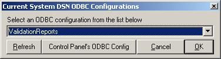



## System DSN ODBC Selections

### Description

Reusable form. Offers selection of trusted ODBC connections (system DSNs only) that are configured on a workstation. Results are ODBC DSN name and type of connection. Short & sweet.   Looking for something your customer only has to click on, this is it -- no manual entry required.
 
### More Info
 

             |
---                |---
**Submitted On**   |2002-11-18 15:07:02
**By**             |[LaVolpe](https://github.com/Planet-Source-Code/PSCIndex/blob/master/ByAuthor/lavolpe.md)
**Level**          |Advanced
**User Rating**    |4.8 (38 globes from 8 users)
**Compatibility**  |VB 6\.0
**Category**       |[Custom Controls/ Forms/  Menus](https://github.com/Planet-Source-Code/PSCIndex/blob/master/ByCategory/custom-controls-forms-menus__1-4.md)
**World**          |[Visual Basic](https://github.com/Planet-Source-Code/PSCIndex/blob/master/ByWorld/visual-basic.md)
**Archive File**   |[System\_DSN14996811182002\.zip](https://github.com/Planet-Source-Code/lavolpe-system-dsn-odbc-selections__1-40845/archive/master.zip)

